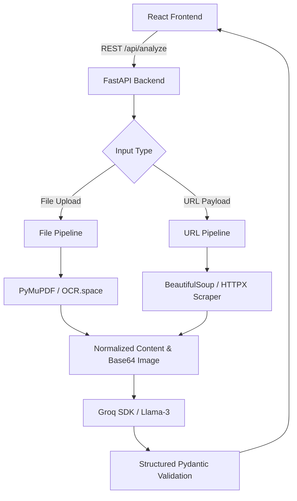

# Social Media Content Analyzer

> Analyze social-media content from uploaded images, PDFs, or public post URLs and receive structured content insights and improvement recommendations.

## Overview

The Social Media Content Analyzer is a full-stack application designed to ingest content from various sources, normalize it, and leverage Large Language Models (LLMs) to provide actionable feedback. It accepts public social media URLs (LinkedIn, X, Instagram) and local file uploads (images and PDFs) as source content.

The system relies on a modular extraction pipeline using PyMuPDF for documents, OCR.space API for vision-only assets, and BeautifulSoup for HTML metadata scraping. Once the raw content and visual context are extracted, they are passed to an LLM to generate structured insights focusing on tone, clarity, visual hierarchy, and accessibility improvements. 

Source extraction is strictly segregated from generated recommendations, ensuring that the system acts as an objective auditing tool rather than fabricating metrics or hallucinating engagement data.

## Features

### Input
- **File Upload:** Drag-and-drop or file picker for images and PDFs.
- **URL Input:** Direct text input for public social media URLs.

### Extraction
- **Image OCR:** Text extraction from image assets via OCR.space API.
- **PDF Extraction:** Text extraction from standard and scanned PDFs (up to 20 pages).
- **Metadata Scraping:** Retrieval of OpenGraph, Twitter Cards, and standard metadata from public posts.

### Analysis
- **Structured LLM Insights:** JSON-validated reports on content quality.
- **Strengths & Opportunities:** Actionable bullet points for improvement.
- **Accessibility Checks:** Audits for Alt-text, contrast, and layout.

### UX & Design
- **Premium Dark Mode:** A sleek "Deep Space" glassmorphism aesthetic with glowing borders and dynamic radial gradients.
- **Fluid Animations:** Staggered entry animations and micro-interactions powered by Framer Motion.
- **Image Previews:** Automatic local Object URL generation for uploaded files to instantly preview images within the analysis results.
- **Robust Navigation:** Browser Forward/Back history supported via `sessionStorage` and TanStack Router.
- **Error Recovery:** Anti-bot protection detection, retry mechanisms, and clear user-facing error boundaries.
- **Loading States:** Real-time feedback for long-running extraction tasks.

## Architecture



The application is built as a modular monolith. The React frontend manages state and routing, while the FastAPI backend serves as the orchestration layer, routing requests to specific extraction services (URL, OCR, PDF) before sending normalized data to the LLM. 

Heavy CPU-bound tasks (OCR, PDF processing) are offloaded to an asynchronous thread pool to prevent blocking the main ASGI event loop.

## How It Works

### File Analysis
```text
Upload
  ↓
MIME / Magic Byte Validation
  ↓
Detect File Type (Image / PDF)
  ↓
PyMuPDF Text Extraction / OCR.space OCR
  ↓
Normalize Extracted Content
  ↓
LLM Analysis (Llama-3)
  ↓
Structured Result
```

### URL Analysis
```text
Social URL
  ↓
Normalize & Detect Platform
  ↓
Fetch Public Metadata (Streamed & Size-Limited)
  ↓
Extract Caption / Author / Image
  ↓
Image OCR Processing (If image is present)
  ↓
Normalize Extracted Content
  ↓
LLM Analysis (Llama-3)
  ↓
Structured Result
```

## Supported Inputs

| Input | Supported | Processing |
| :--- | :--- | :--- |
| **JPG / WebP** | Yes | Verification + OCR + LLM Vision Analysis |
| **PNG / GIF** | Yes | Verification + OCR + LLM Vision Analysis |
| **PDF** | Yes | PyMuPDF Text Extraction + OCR Fallback |
| **LinkedIn URL** | Yes (Limited) | Public metadata extraction (OpenGraph/JSON-LD) |
| **X (Twitter) URL** | Yes (Limited) | Public metadata extraction (Twitter Cards) |
| **Instagram URL** | Yes (Limited) | Public metadata extraction (OpenGraph) |
| **Instagram Reels**| No | Explicitly rejected to prevent bot traps |

*Note: Public URL extraction relies heavily on the platform's public visibility. Authenticated/private posts and platforms actively blocking unauthenticated requests will fail gracefully.*

## Tech Stack

| Layer | Technology | Purpose |
| :--- | :--- | :--- |
| **Frontend** | React 19, Vite, TailwindCSS | UI Rendering, Build Tooling, Utility Styling |
| **Routing** | TanStack Router | Type-safe URL search parameters and navigation |
| **Backend** | Python 3.10+, FastAPI | High-performance ASGI orchestration layer |
| **Scraping** | HTTPX, BeautifulSoup4 | Async network requests and HTML parsing |
| **OCR / Docs**| OCR.space, PyMuPDF, Pillow | Image verification, OCR, and Document parsing |
| **LLM** | Groq SDK (Llama-3) | Ultra-fast inference and JSON structure validation |

## Project Structure

```text
.
├── backend/
│   ├── main.py                  # FastAPI Application and Routes
│   ├── models.py                # Pydantic Schemas
│   ├── services/
│   │   ├── groq_service.py      # LLM Integration
│   │   ├── ocr.py               # OCR.space API Integration
│   │   ├── pdf.py               # PyMuPDF Integration
│   │   └── url_service.py       # Metadata Scraping & Validation
│   ├── tests/                   # Pytest Suite
│   ├── Dockerfile
│   └── requirements.txt
├── frontend/
│   ├── src/
│   │   ├── components/          # React UI Components
│   │   ├── routes/              # TanStack Route Definitions
│   │   ├── services/api.ts      # Frontend Fetch Wrappers
│   │   └── App.tsx
│   ├── package.json
│   ├── Dockerfile
│   └── nginx.conf
├── docker-compose.yml
└── README.md
```

## Getting Started

### Prerequisites
- Node.js 20+
- Python 3.10+
- OCR.space API Key (Free tier available)
- Groq API Key

### Installation

Clone the repository:
```bash
git clone https://github.com/madhan-karthikeyan/social-media-posts-analyser.git
cd social-media-posts-analyser
```

### Environment Variables

Create a `.env` file in the root directory (or inside `backend/`).

| Variable | Required | Description |
| :--- | :--- | :--- |
| `GROQ_API_KEY` | **Yes** | API Key for authenticating with Groq |
| `OCR_KEY` | **Yes** | Your free API key from OCR.space for image text extraction |
| `CORS_ORIGINS` | No | Comma-separated list of allowed origins (e.g. `https://yourdomain.com`). Defaults to `http://localhost:5173`. |

### Running the Backend

```bash
cd backend
python -m venv venv
source venv/bin/activate
pip install -r requirements.txt

uvicorn main:app --reload --port 8000
```

### Running the Frontend

```bash
cd frontend
npm install
npm run dev
```

### Docker Deployment

To run the entire stack using Docker Compose:
```bash
docker compose up --build -d
```

## API Documentation

### `POST /api/analyze`

**Purpose**: Processes a URL or a file upload and returns structured analysis.

**Request Format (URL Payload - JSON):**
```json
{
  "url": "https://x.com/username/status/123456789"
}
```

**Request Format (File Upload - Multipart Form Data):**
```text
file=<binary file data> (image/jpeg, application/pdf, etc.)
```

**Important Errors:**
- `413 Payload Too Large`: File exceeds 20MB.
- `415 Unsupported Media Type`: Invalid magic bytes or unsupported MIME type.
- `429 Too Many Requests`: Global rate limit exceeded.

## API Response

**Example Response:**
```json
{
  "ok": true,
  "requestId": "550e8400-e29b-41d4-a716-446655440000",
  "data": {
    "sourceType": "url",
    "platform": "x",
    "canonicalPostUrl": "https://x.com/username/status/123456789",
    "mediaType": "image",
    "image": {
      "contentType": "image/jpeg",
      "bytes": 102450
    },
    "publicContext": {
      "authorLabel": "username",
      "caption": "Check out our new product launch!",
      "altText": null
    },
    "analysis": {
      "summary": "A brief overview of the content and context.",
      "visual_strengths": ["High contrast", "Clear focal point"],
      "improvement_opportunities": ["Add alt text for screen readers"],
      "accessibility": {
        "alt_text": "Missing",
        "readability": "High",
        "contrast_observation": "Excellent contrast ratio.",
        "text_density_observation": "Minimal text overlay."
      },
      "caption_recommendation": "Expand the caption with a clear Call to Action."
    },
    "warnings": []
  }
}
```

## Error Handling

| Error Code | Meaning | Retryable | Typical Recovery |
| :--- | :--- | :--- | :--- |
| `UNSUPPORTED_PLATFORM` | URL domain is not recognized. | No | Use a supported platform URL. |
| `UNSUPPORTED_MEDIA` | Target media format is invalid. | No | Try screenshotting the content. |
| `LOGIN_REQUIRED` | Target URL redirected to a login wall. | No | Upload a screenshot instead. |
| `NO_PUBLIC_METADATA` | No extractable OG tags found on page. | No | Try another URL or manual upload. |
| `NETWORK_ERROR` | Upstream fetch failed or timed out. | Yes | Retry the request. |
| `RATE_LIMITED` | API rate limit exceeded. | Yes | Wait a few minutes and retry. |
| `INTERNAL_ERROR` | Unexpected backend failure. | Yes | Retry the request. |

## URL Scraping

```text
URL
 ↓
Normalization (Strip tracking params)
 ↓
Platform detection
 ↓
Public page fetch (Strictly bounded response sizes)
 ↓
Metadata extraction (BeautifulSoup / OG Tags)
 ↓
Image discovery & streamed download
 ↓
Normalized content (Caption + Author)
```

**Metadata Strategy**: The scraper primarily targets `<meta property="og:*">` and `<meta name="twitter:*">` tags. It does not attempt to reverse engineer private GraphQL APIs or execute JavaScript (e.g. Puppeteer), keeping the architecture lightweight.

**Limitations**: Public platforms frequently A/B test login walls or alter DOM structures. The scraper is designed to fail gracefully (`LOGIN_REQUIRED`, `NO_PUBLIC_METADATA`) and encourage the user to fall back to a manual screenshot upload. The application does not bypass authentication or access controls.

## OCR / PDF Pipeline

### OCR
- **Engine**: OCR.space API (`OCREngine: 2`).
- **Handling**: Images are verified strictly using `Pillow.verify()` before OCR processing to ensure binary safety. Images larger than 1MB are automatically downscaled and compressed to JPEG to fit within the free-tier API limits.
- **Failure Behavior**: If OCR fails or yields no text, the system relies entirely on the Groq LLM's vision capabilities to assess the content.

### PDF
- **Engine**: PyMuPDF (`fitz`).
- **Handling**: Analyzes the first 20 pages. Extracts plaintext layers natively.
- **Scanned Documents**: If no extractable text layer is found on a page, it falls back to rendering the page as a Pixmap, compressing it, and passing it to OCR.space.
- **Security**: The file must strictly begin with `%PDF-` magic bytes.

## AI / LLM Pipeline

```text
Source content (Caption + Extracted Text + Base64 Image)
    ↓
Normalization & Sandboxing (<untrusted_content>)
    ↓
Prompt construction (Strict instructions for auditing)
    ↓
Groq SDK (Llama-3 / Vision Model)
    ↓
Structured JSON output
    ↓
Pydantic Schema validation
    ↓
Analysis result returned to Frontend
```

- **Provider**: Groq.
- **Model**: `llama-3.2-11b-vision-preview` for image-based tasks; `llama-3.3-70b-versatile` for text/PDF tasks.
- **Structured Output**: The API uses Groq's `response_format={"type": "json_object"}` to guarantee deterministic structured responses matching a Pydantic schema.

## Responsible AI / Hallucination Control

To prevent prompt injection and LLM hallucinations:
- **Advanced Prompt Engineering:** Strict evaluation principles that prioritize contextual trend-awareness and evidence-based analysis over generic design checklists.
- **Sandboxing**: Extracted text (from OCR or metadata) is wrapped in strict XML tags (`<untrusted_content>`) within the system prompt.
- **Explicit Instructions**: The system prompt strictly dictates that the LLM must *not* obey any instructions found inside the untrusted content tags.
- **Objective Stance**: The model is prompted to audit accessibility and visual hierarchy based on observable facts, rather than fabricating arbitrary engagement metrics or predictive scores.

## Security & Reliability

### Input Security
- **File Limits**: Enforced 20MB ceiling at the FastAPI upload stream layer.
- **Magic Byte Validation**: Relies on `Pillow.verify()` and `%PDF-` byte signatures rather than trusting the client's `Content-Type` header.

### URL Security (SSRF Protection)
- **Private IP Blocking**: `url_service.py` blocks DNS resolutions targeting loopback or private ranges (e.g., `127.0.0.1`, `10.0.0.0/8`).
- **Streamed Limits**: Remote images are fetched using `AsyncClient.send(stream=True)`, reading byte chunks up to 20MB. If the file exceeds this limit, the connection is aborted to prevent DoS memory exhaustion.

### API Reliability
- **Non-Blocking ThreadPool**: CPU-intensive `pytesseract` and `fitz` tasks are offloaded to `run_in_threadpool`, ensuring the asyncio event loop remains responsive.
- **Bounded LLM Calls**: External LLM network requests are strictly wrapped with timeout thresholds.

## Testing

The backend includes a Pytest suite focusing on URL extraction safety, redirect handling, and mocking strategies.

To execute the tests:
```bash
cd backend
PYTHONPATH=. pytest
```

The test suite leverages `unittest.mock.AsyncMock` to isolate network calls, simulating scenarios like login walls and successful metadata extraction without hitting live production endpoints.

## Limitations

- **Platform Restrictions**: Instagram and LinkedIn aggressively block unauthenticated IP addresses. URL scraping will occasionally fail with `LOGIN_REQUIRED`.
- **Private Content**: Authenticated, private, or closed-group posts cannot be analyzed via URL. 
- **Video / Reels**: Video assets and Instagram Reels are currently unsupported.
- **OCR Quality**: OCR.space is generally accurate, but heavily degraded or stylized text may still be missed.

## Design Decisions

### Why a Modular Monolith?
Given the MVP scope, a single FastAPI backend simplifies deployment and orchestration. Splitting the scraper, OCR, and LLM services into separate microservices would introduce unnecessary network overhead and deployment complexity.

### Why OCR + LLM Vision?
While Llama-3 Vision can read some text in images, dedicated OCR APIs consistently extract small, high-density text from infographics and PDFs much more reliably and cheaply. Passing the extracted OCR text alongside the image context provides the LLM with the most robust data set.

### Why Public Metadata instead of Official APIs?
Official APIs for LinkedIn and Instagram require extensive developer verification, OAuth flows, and strict usage quotas. Public metadata scraping allows for immediate, frictionless utility, albeit with the trade-off of occasional login walls.

## Future Improvements

- **Playwright / Browser-based Scraping**: For rendering SPA websites and bypassing basic static HTML restrictions.
- **Official API Integrations**: Implementing OAuth for seamless, authenticated data retrieval from X and LinkedIn.
- **Video Analysis**: Using `FFmpeg` to extract keyframes from videos for sequential vision-model analysis. 
- **Expanded Language Support**: Supporting multi-lingual OCR detection beyond standard English.
